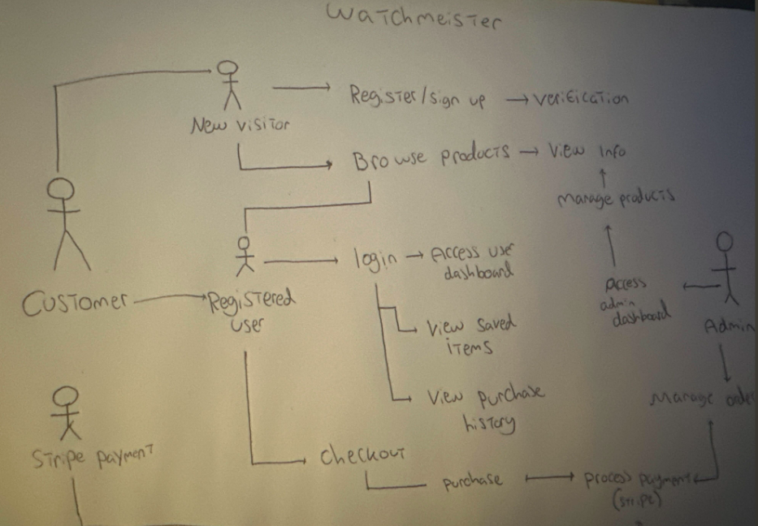

# Watchmeister

## Table of contents

1. [Introduction](#introduction)
2. [Objective](#objective)
3. [Key Features](key-features)
    - [Navigation](#navigation)
    - [Home Page](#home-page)
    - [Profile Page](#profile-page)
    - [Admin Features](#admin-features)
4. [UX/UI](uxui)
    - [User Stories](#user-stories)
        - [New Visitor](#new-visitor)
        - [Returning User](#returning-user)
        - [Frequent User](#frequent-user)
        - [Admin](#admin)
    - [Colour Scheme](#colour-scheme)
        - [Primary Colour](#colour-scheme)
        - [Primary Colour](#primary-colour)
        - [Secondary Colour](#secondary-colour)
        - [Accent Colour](#accent-colour)
        - [Supporting Colours](#supporting-colours)
        - [Background Colour](#background-colour)
    - [Typography](#typography)
5. [Wireframes](#wireframes)
    - [Home Page](#home-page1)
6. [UML Use Case Diagram](#uml-use-case-diagram)
7. [Database](#database)
    - [Entity-Relationship Diagram (ERD)](#entity-relationship-diagram-erd)
8. [Testing](#testing)
9. [Deployment](#deployment)
10. [Planned Improvements](#planned-improvements)
11. [Tools and Technologies Used](#tools-and-technologies-used)
12. [Credits](#credits)
13. [Acknowledgments](#acknowledgments)

---

## Introduction
Welcome to Watchmeister, my Milestone Project 4 for the level 5 Diploma in Full Stack Web Application Development!  
This project will demonstrate my full-stack web development skills by creating a fully functional ecommerce web application.  

**Live Site** https://watchmeister-c5a867aaaced.herokuapp.com/

## Objective
The main aim of Watchmeister is to offer a luxury styled, engaging experience for watch customers. The application uses modern web technologies to provide a dynamic solution that meets both personal and commercial needs.

## Key Features

- **User Management:** Allows users to register, log in, and manage their personal accounts.

- **Product Purchasing:** Offers a range of products, with features to add items to the bag and proceed through a secure checkout process.

- **Secure Payments:** Integrates Stripe for safe and efficient payment handling.

- **Media Storage** Utilities Amazon S3 for reliable and scalable storage of media files, such as images of watches.

- **Admin Features** Provides administrators with tools to manage product listings.

### Navigation 

### Home Page

### Profile Page

### Admin Features

## UX/UI
### User Stories

**New Visitor**
- As a first-time visitor, I want to explore the available watches without having to create an account, so i can decide if I'm interested in what's being offered on the website.

- As a first-time visitor, I want to see the detailed information about each watch essentially seeing a description of the product.

- As a first-time visitor, I want to have the ability to register using my email, so I can access the other features of the website.

**As a Returning User**
- As a returning user, I want to log in quickly to my account and be able to see my saved inforation.

- As a returning user, I want to see the items I left in the bag from my last session so I can easily pick off from where I last was.

- As a returning user, I want to view my previously purchased items incase I want to buy another.

**As an Admin**

- As an admin, I want to add, update or remove products from my store.

- As an admin, I want to view and manage user accounts, so I can ensure a smooth user experience.

---

### Colour Scheme

For the Watchmeister web application, I've selected a streamlined basic colour scheme to ensure both style and readability, simplicity and adamant.

### Typography

I've selected Playfair Display and serif for my two fonts to ensure the feel of the website is luxury and elegance.

**[Playfair Display](https://fonts.google.com/specimen/Playfair+Display)** adds elegance to website.

**[Serif](https://fonts.google.com/specimen/PT+Serif)** provides readability for the main text

---

### Wireframes

#### Home Page

## UML Use Case Diagram

I have created the ULM Case Diagram to depict how different types of users and administrators interact with the system.

## Database 
For development, I have used the SqLite3 database, as it is the default option for Django projects and is straightforward to set up in a development environment. When the site moves to Heroku, I will switch to PostgreSQL.

---

### Entitiy-Relationship Diagram (ERD)

The Entity-Relationship Diagram (ERD) for this project provides a clear representation of the database structure. It shows how key entities such as users, roles, profiles, products, orders, are related to each other.

## Models Overview

### 1. User and Profile

**AuthUser**: Represents the users of the store with fields for authentication (username, password, email)
7:53
### 2. Orders
 - **CheckoutOrder**: Captures order details, including customer information (name, email), order totals, and selected delivery method. Each user can place multiple orders (One-to-Many relationship).
 - **CheckoutOrderitem**: Represents individual items within an order, including product details and quantity. Each order can contain several order items (One-to-Many relationship).
### 3. Products
 - **ProductsWatchmeister**: Defines the products available for purchase, with attributes such as SKU, name, description, and price. Each product can be linked to multiple order items (Many-to-One relationship).
### 4. VAT model (custom model)
 - **VAT**: Defines the use of VAT as a custom model.
### 5. FEEDBACK (custom model)
 - **FEEDBACK**: Defines the use of feedback form as a custom model.

---

## Testing
The apps functionalty was also tested by friends and family. Their feedback was invaluable in identifying any issues and making necessary improvements.

## Deployment
- **App Deployment:** The Henna Store app was deployed on Heroku, a cloud platform that facilitates easy and scalable application hosting. For more information about Heroku, click [here](https://www.heroku.com/).

- **Database Deployment:** The PostgreSQL database is used for data management, provided by Code Institute for students. More information about PostgreSQL can be found [here](https://www.postgresql.org/).

- **Static Files Deployment:** The app utilises Amazon S3 for hosting static files, ensuring efficient file storage and delivery. Learn more about S3 [here](https://aws.amazon.com/s3/).

- **Stripe Payments Integration:** The app incorporates Stripe for secure payment processing, including payment hooks and setup. Find out more about Stripe [here](https://stripe.com/docs).

---

## Tools and Technologies Used

- **Backend:**
  - **[Django](https://www.djangoproject.com/)**: The web framework managing server-side logic and interactions.
  - **[Python](https://www.python.org/)**: The primary programming language for backend development.
  - **[PostgreSQL](https://www.postgresql.org/)**: A robust relational database used for handling data storage and queries.

- **Frontend:**
  - **[HTML](https://developer.mozilla.org/en-US/docs/Web/HTML)** / **[CSS](https://developer.mozilla.org/en-US/docs/Web/CSS)**: Utilised for structuring and styling the user interface.
  - **[JavaScript](https://developer.mozilla.org/en-US/docs/Web/JavaScript)**: Enhances the interactivity of the application.

- **Payment Processing:**
  - **[Stripe](https://stripe.com/)**: Used to handle secure card payments and payment intent functionalities.

- **Deployment and Version Control:**
  - **[Heroku](https://www.heroku.com/)**: For deploying and managing the application.
  - **[GitHub](https://github.com/)**: For version control and collaboration.

- **File Storage:**
  - **[AWS S3](https://aws.amazon.com/s3/)**: Used to manage static files and media storage for reliable content delivery.

---
## Other Tools

- **Image Resizing:** [Birme.net](https://www.birme.net/) was used to resize images.
- **Wireframing:** [Balsamiq](https://balsamiq.com/) helped create wireframes for the application.
- **Performance Testing:** [Lighthouse](https://developers.google.com/web/tools/lighthouse) was employed to evaluate and optimise the app’s performance.
- **HTML & JavaScript Validation:** [HTMLHint](https://htmlhint.com/) and [JSHint](https://jshint.com/) were used to ensure clean and error-free code.
- **Image Editing:** [GIMP](https://www.gimp.org/) was used for image editing and custom graphics creation.

---  

## Credits

- **Background Images:** Images sourced from [PNGTree](https://www.pngtree.com/) and [Freepik](https://www.freepik.com/).
- **Favicon:** Created using a [favicon generator](https://www.favicon-generator.org/).

---

#### Research Websites

- **Django Documentation:** Learn more about Django at [Django Docs](https://docs.djangoproject.com/).
- **PostgreSQL Documentation:** Explore PostgreSQL's capabilities at [PostgreSQL Docs](https://www.postgresql.org/docs/).
- **Stripe Documentation:** Discover Stripe's functionalities at [Stripe Docs](https://stripe.com/docs).
- **W3Schools:** Comprehensive tutorials and references on HTML, CSS, JavaScript, and more. Visit [W3Schools](https://www.w3schools.com/).
- **MDN Web Docs:** Detailed documentation for web development technologies, including HTML, CSS, and JavaScript. Visit [MDN Web Docs](https://developer.mozilla.org/).
- **Stack Overflow:** A community platform to find answers to coding questions and learn from others. Visit [Stack Overflow](https://stackoverflow.com/).
- **GitHub Learning Lab:** Learn about version control and collaboration with GitHub tutorials. Visit [GitHub Learning Lab](https://lab.github.com/).

---
